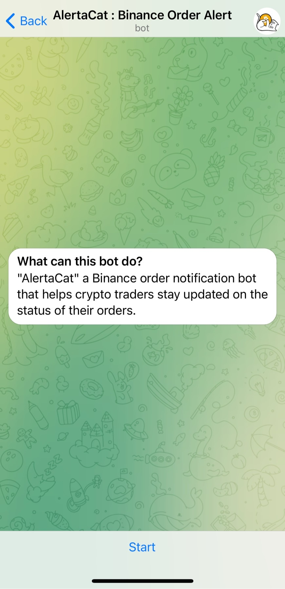
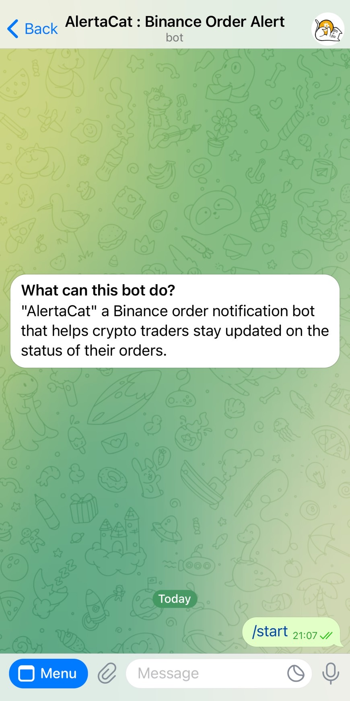
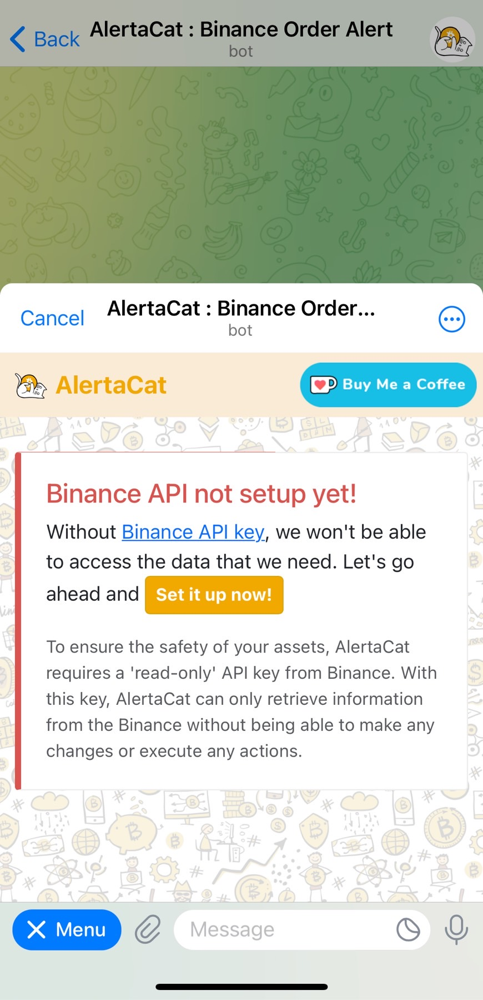
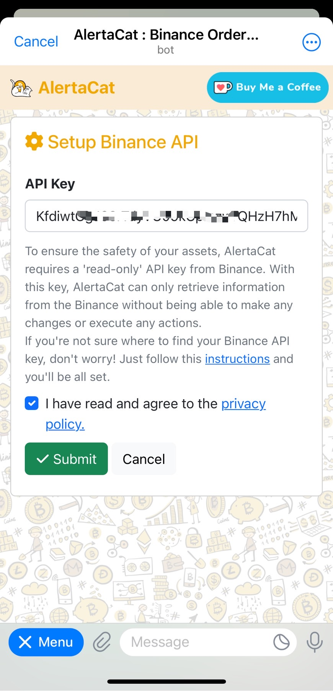
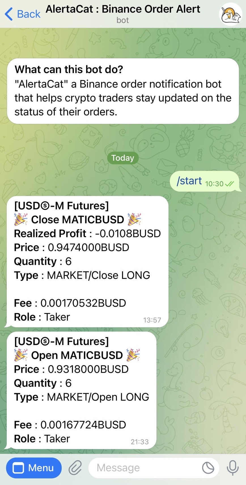

#   AlertaCat - Binance Order Filled Notification Bot 

Hello and welcome to Alertacat Project! Our bot is designed to help users stay informed about changes in their crypto orders on Binance **Spot & USDⓈ-M Future**. All you need to do is connect your Binance API data through **Telegram** ([@alertacat_bot](https://t.me/alertacat_bot)) and our app will do the rest. We offer this service as a way to support and assist crypto traders, and we appreciate any support you can give us in return. If you'd like to donate to help keep Alertacat running, you can visit our Ko-fi page at ko-fi.com/alertacat . All donations go towards helping us improve and maintain the app for our users. Thank you for considering supporting us!

**Feature**
- Binance Spot Order Filled Notification
- Binance USDⓈ-M Future Order Filled Notification
## Try It Now!!
Start AlertaCat bot now by starting a conversation with our Telegram bot [@alertacat_bot](https://t.me/alertacat_bot)
## How to Setup

1. Go to Telegram and add AlertaCat bot [@alertacat_bot](https://t.me/alertacat_bot) and tap Start.

2. Tap on the "Menu" button in the left bottom corner.

3. Tap on the "Set it up now!" button to setup Binance API Key.

4. Insert the **Binance API Key** that you have obtained from the Binance API management into the "API Key" field and then press the Submit button.
- Please rest assured that your Binance API Key will only be used for **read-only** purposes, keeping your account secure and protected at all times.
- In addition, we want to make it clear that **we do not have access to your API secret key**, which means that we cannot make any changes, execute any trades, or manage any risk activities on your account.

5. Now you are ready to wait for a new notification.
- You can tap on "Menu" in the left bottom corner to close this window. 

6. When your order is updated, you will receive a Telegram notification similar to the following example

## Donate

I would really appreciate it if you could help support its ongoing development and maintenance by making a small donation through Ko-fi. Your support will help me to continue improving "AlertaCat" and bring new features to users like you. Thank you for considering a donation, and for using "AlertaCat"! Every little bit helps.

